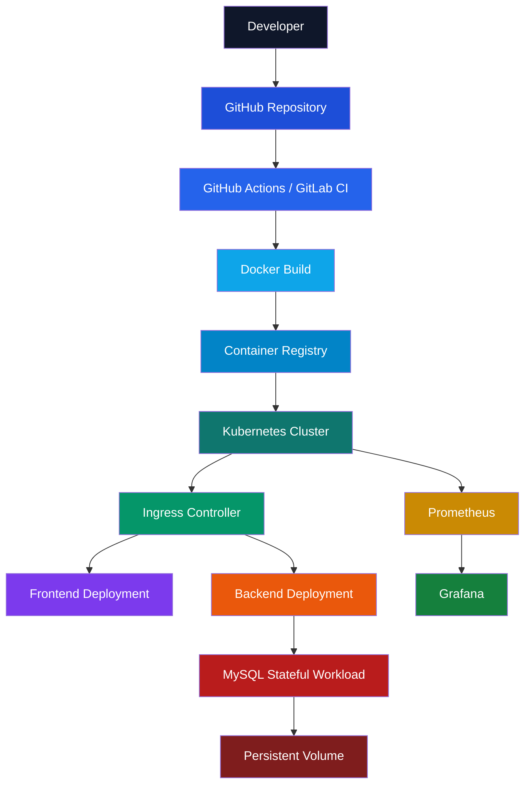

<!-- ===========================================================
                     DEVOPS ENGINEER DASHBOARD
                    Varad Jadhav — GitHub Profile
============================================================ -->

<div align="center">


<br>

[](https://git.io/typing-svg)

<br>


</div>

---

# 👋 Hello, I'm Varad Jadhav

### 🚀 DevOps Engineer | Software Developer | Cloud Enthusiast

I enjoy building scalable cloud-native applications, automating infrastructure, and creating reliable CI/CD pipelines.

My passion lies in bridging the gap between software development and operations using modern DevOps practices, Infrastructure as Code, Kubernetes, containerization, cloud computing, monitoring, and automation.

---

# 💡 About Me

```yaml
Name: Varad Jadhav
Location: Sangli, Maharashtra, India
Role: DevOps Engineer

Education:
  Bachelor of Technology
  Computer Engineering

Interested In:
  - Cloud Computing
  - DevOps
  - Platform Engineering
  - Kubernetes
  - Infrastructure Automation
  - Observability
  - AI for Operations

Currently Building:
  - Kubernetes Production Deployments
  - AI Powered DevOps Platform
  - Monitoring Stack
  - StockSense AI

Learning:
  - OpenShift
  - GitOps
  - ArgoCD
  - MLOps
  - AIOps

Career Goal:
  Become a Cloud Native DevOps Engineer
```

---

# 🏗 DevOps Engineering Philosophy

> **"Automate everything that is repetitive. Monitor everything that matters. Build systems that are reliable, scalable, and easy to maintain."**

---

# 📊 Developer Dashboard

<table>
<tr>
<td width="50%">

## 💼 Professional Summary

- 🚀 DevOps Engineer
- ☁️ Cloud Enthusiast
- 🐳 Docker & Kubernetes Practitioner
- ⚙️ Infrastructure Automation
- 🔄 CI/CD Pipeline Developer
- 📈 Monitoring & Observability
- 💻 Full Stack Development
- 📚 Continuous Learner

</td>
<td width="50%">

## 🎯 Current Focus

✅ Kubernetes
✅ AWS Cloud
✅ Terraform
✅ Prometheus
✅ Grafana
✅ GitHub Actions
✅ GitLab CI/CD
✅ OpenShift

</td>
</tr>
</table>

---

# 🌍 What I Do

<table>
<tr>
<td width="50%">

### ☁️ Cloud
Design and deploy scalable cloud infrastructure using AWS and Infrastructure as Code.

</td>
<td width="50%">

### ⚙️ DevOps
Automate application deployment with Docker, Kubernetes, Jenkins, GitHub Actions, and GitLab CI/CD.

</td>
</tr>
<tr>
<td width="50%">

### 📈 Monitoring
Implement monitoring and alerting using Prometheus and Grafana.

</td>
<td width="50%">

### 💻 Development
Build backend services, REST APIs, and full-stack applications.

</td>
</tr>
</table>

---

# 🏗 DevOps Workflow

```text
              Developer
                  │
                  ▼
           Push Source Code
                  │
                  ▼
      GitHub / GitLab Repository
                  │
                  ▼
        CI/CD Pipeline Trigger
                  │
      Build • Test • Security Scan
                  │
                  ▼
           Docker Image Build
                  │
                  ▼
        Push Image to Registry
                  │
                  ▼
       Kubernetes Deployment
                  │
                  ▼
       Services & Ingress Route
                  │
                  ▼
      Frontend  ←→  Backend API
                  │
                  ▼
           MySQL Database
                  │
                  ▼
     Prometheus Metrics Collection
                  │
                  ▼
         Grafana Dashboards
                  │
                  ▼
         Production Monitoring
```

---

# ☸ Kubernetes Architecture



---

# 🚀 Engineering Mindset

<table>
<tr>
<td width="33%">

## 🔄 Automate
- Infrastructure
- Deployments
- Testing
- Monitoring
- Scaling

</td>
<td width="33%">

## 📦 Build
- Cloud Native Apps
- REST APIs
- CI/CD Pipelines
- Kubernetes Platforms
- Infrastructure

</td>
<td width="33%">

## 📈 Improve
- Reliability
- Performance
- Security
- Scalability
- Developer Experience

</td>
</tr>
</table>

---

# 🌟 Areas of Interest

- ☁ Cloud Native Computing
- ☸ Kubernetes
- 🐳 Docker
- ⚙ Infrastructure as Code
- 🔄 Continuous Integration
- 🚀 Continuous Deployment
- 📈 Monitoring
- 🔐 DevSecOps
- 🤖 AIOps
- 🧠 MLOps
- 🌍 Open Source

---

# 📌 Quick Facts

```text
💻 DevOps Engineer
☁ Cloud Enthusiast
🚀 Software Developer
🐧 Linux Lover
☸ Kubernetes Practitioner
🐳 Docker Expert
⚙ Automation First
📈 Monitoring Matters
🤝 Open Source Supporter
📚 Lifelong Learner
```

---

<div align="center">

### ⭐ Building scalable systems through Automation • Cloud • DevOps ⭐

</div>

---

# ⚙️ Tech Stack

## 💻 Programming Languages

<p align="center">

</p>

| Language | Usage |
|-----------|-------|
| 🐍 Python | Automation, AI, FastAPI, Scripts |
| ☕ Java | Core Programming |
| 🌐 JavaScript | Backend & Frontend |
| 🖥 Bash | Linux Automation |
| ⚙ C | Programming Fundamentals |

## 🌐 Frontend Development

<p align="center">

</p>

| Technology | Purpose |
|------------|---------|
| React | User Interfaces |
| HTML5 | Web Structure |
| CSS3 | Styling |

## 🖥 Backend Development

<p align="center">

</p>

| Technology | Purpose |
|------------|---------|
| Node.js | Runtime Environment |
| Express.js | REST API Development |

## 💾 Databases

<p align="center">

</p>

| Database | Purpose |
|----------|---------|
| MySQL | Relational Database |
| MongoDB | NoSQL Database |

## ☁️ Cloud Technologies

<p align="center">

</p>

| Cloud | Experience |
|--------|------------|
| AWS | EC2, IAM, S3, CLI |
| Azure | Fundamentals |

## ⚙️ DevOps Technologies

<p align="center">

</p>

| Technology | Usage |
|------------|-------|
| Docker | Containerization |
| Kubernetes | Container Orchestration |
| Terraform | Infrastructure as Code |
| Ansible | Configuration Management |
| Jenkins | CI/CD |
| GitLab CI/CD | Pipeline Automation |
| GitHub Actions | Workflow Automation |

## 📈 Monitoring & Observability

<p align="center">

</p>

| Tool | Purpose |
|------|---------|
| Prometheus | Metrics Collection |
| Grafana | Dashboards & Monitoring |

## 🐧 Operating Systems

<p align="center">

</p>

| OS | Usage |
|----|-------|
| Linux | Primary Development |
| Ubuntu | Development Environment |
| RHEL | Enterprise Linux |

## 🛠 Development Tools

<p align="center">

</p>

| Tool | Purpose |
|------|---------|
| Git | Version Control |
| GitHub | Source Control |
| VS Code | Development |
| Postman | API Testing |
| NGINX | Reverse Proxy |

---

# 📊 GitHub Analytics Dashboard

<p align="center">


</p>

# 🔥 GitHub Contribution Streak

<p align="center">

</p>

# 📈 Contribution Activity Graph

<p align="center">

</p>

# 🏆 GitHub Trophies

<p align="center">

</p>

# 📅 GitHub Metrics Dashboard

<p align="center">

</p>

> 📊 Automatically generated using the **lowlighter/metrics** GitHub Action. Displays repository activity, commits, pull requests, issues, stars, language usage, and coding statistics. Generated by the included `.github/workflows/metrics.yml` — run it once from the Actions tab after your first push.

# 🐍 Contribution Snake

<p align="center">

</p>

> ⚡ Generated automatically using the included `.github/workflows/snake.yml` GitHub Action.

# 📈 Coding Activity

<p align="center">

</p>

# 📊 Summary Cards

<p align="center">


</p>

<p align="center">


</p>

> ℹ️ These four cards are served live by the `github-profile-summary-cards` Vercel app (same model as `github-readme-stats`) — no workflow needed, they just work once pushed.

---

# ⚡ DevOps Skill Matrix

| Category | Technologies |
|-----------|--------------|
| 🐳 Containerization | Docker |
| ☸ Orchestration | Kubernetes |
| ☁ Cloud | AWS, Azure |
| 🔄 CI/CD | Jenkins, GitHub Actions, GitLab CI/CD |
| ⚙ IaC | Terraform |
| 🖥 Configuration | Ansible |
| 📈 Monitoring | Prometheus, Grafana |
| 💻 Development | Node.js, Express, React |
| 🗄 Databases | MySQL, MongoDB |
| 🐧 OS | Linux, Ubuntu, RHEL |

---

# 📚 Currently Mastering

```text
Kubernetes     █████████████████████████████████████ ✅
Docker         █████████████████████████████████████ ✅
AWS            ██████████████████████████████░░░░░░░ ✅
Terraform      ██████████████████████████░░░░░░░░░░░ ✅
Prometheus     ██████████████████████░░░░░░░░░░░░░░░ ✅
Grafana        ████████████████████░░░░░░░░░░░░░░░░░ ✅
OpenShift      ██████████████████░░░░░░░░░░░░░░░░░░░ 🔄
GitOps         ██████████████░░░░░░░░░░░░░░░░░░░░░░░ 🔄
ArgoCD         ██████████░░░░░░░░░░░░░░░░░░░░░░░░░░░ 🔄
MLOps          ████████░░░░░░░░░░░░░░░░░░░░░░░░░░░░░ 🔄
AIOps          ██████░░░░░░░░░░░░░░░░░░░░░░░░░░░░░░░ 🔄
```

---

<div align="center">

## 🚀 "Measure Everything • Automate Everything • Improve Continuously"

</div>

---

# 🚀 Featured Production Projects

## 💰 Finance Tracker Platform

> **A production-style three-tier Finance Management Application deployed on Kubernetes using GitLab CI/CD.**

**Architecture:**
```text
User
  │
  ▼
NGINX Ingress
  │
  ├──────────────┐
  ▼              ▼
React Frontend  Node.js Backend
                    │
                    ▼
              MySQL Database
                    │
                    ▼
              Persistent Volume

Kubernetes Cluster ← GitLab CI/CD Pipeline ← Docker Registry
```

**Key Features:**
- Production-ready Kubernetes deployment
- Dockerized frontend and backend
- MySQL Persistent Volume
- Kubernetes Secrets & ConfigMaps
- Ingress Controller
- GitLab CI/CD automation
- Health checks & rolling updates
- Scalable architecture

**Tech Stack:** React, Node.js, Express, MySQL, Docker, Kubernetes, GitLab CI/CD, NGINX, Linux

---

## 📈 StockSense AI

> **AI-powered stock market analysis platform for intelligent investment insights using historical and live market data.**

**Architecture:**
```text
Stock Market APIs → Historical Data → FastAPI Backend
  → Machine Learning → Prediction Engine → REST API → Dashboard
```

**Features:**
- Historical stock analysis
- AI-based prediction engine
- REST APIs & data preprocessing
- Dockerized backend, FastAPI architecture

**Tech Stack:** Python, FastAPI, Machine Learning, Docker, Pandas, NumPy

---

## ☸ Kubernetes Notes Application

> **Containerized Notes Application demonstrating Kubernetes deployments and cloud-native architecture.**

**Architecture:**
```text
Browser → NGINX → Node.js API → MySQL → Persistent Volume
```

**Features:**
- Dockerized application
- Kubernetes Deployments & Services
- Persistent Volumes, ConfigMaps, Secrets
- Ingress & namespace isolation

**Tech Stack:** Docker, Node.js, Express, MySQL, Kubernetes, NGINX

---

## ☁ Infrastructure Automation

> **Provisioning AWS infrastructure using Infrastructure as Code.**

**Features:** EC2 deployment, IAM configuration, S3 bucket creation, security groups, Terraform modules, infrastructure automation

**Tech Stack:** Terraform, AWS, Linux

---

## 📊 Monitoring Stack

> **Production monitoring solution for Kubernetes workloads.**

**Components:** Prometheus → Grafana → Kubernetes Metrics → Dashboards → Alerting

**Features:** Cluster monitoring, node & pod metrics, dashboard visualization, performance monitoring

---

## ⚙ Jenkins Shared Library

> **Reusable CI/CD pipeline library for enterprise Jenkins automation.**

**Features:** Reusable pipeline functions, Docker build automation, image push, deployment automation, pipeline standardization

---

# 📌 Featured Repository Cards

> ⚠️ Replace the repository names below with the **exact, case-sensitive** names of your public repos.

<p align="center">
<a href="https://github.com/Varad-ctrl/stocksense-ai"></a>
<a href="https://github.com/Varad-ctrl/fintrack-app"></a>
</p>

<p align="center">
<a href="https://github.com/Varad-ctrl/notes-app-dockerize"></a>
<a href="https://github.com/Varad-ctrl/jenkins-shared-library"></a>
</p>

> Also pin the same repos via *GitHub → Your Profile → Customize your pins* so both stay in sync.

---

# 🏆 Engineering Highlights

<table>
<tr>
<td width="33%">

## ☁ Cloud
- AWS
- Azure
- EC2
- IAM
- S3

</td>
<td width="33%">

## ⚙ DevOps
- Docker
- Kubernetes
- Terraform
- Jenkins
- GitLab CI/CD
- GitHub Actions

</td>
<td width="33%">

## 📈 Monitoring
- Prometheus
- Grafana
- Metrics
- Dashboards

</td>
</tr>
</table>

---

# 📊 DevOps Skills Dashboard

```text
Linux                     ██████████ 100%
Git                       ██████████ 100%
GitHub                    ██████████ 100%
Docker                    ██████████ 100%
Docker Compose            ██████████ 100%
Kubernetes                █████████░ 90%
Terraform                 ████████░░ 80%
AWS                       ████████░░ 80%
Ansible                   ████████░░ 80%
GitLab CI/CD              ████████░░ 80%
GitHub Actions            ███████░░░ 70%
Prometheus                ███████░░░ 70%
Grafana                   ███████░░░ 70%
OpenShift                 ██████░░░░ 60%
GitOps                    █████░░░░░ 50%
ArgoCD                    █████░░░░░ 50%
MLOps                     ████░░░░░░ 40%
AIOps                     ███░░░░░░░ 30%
```

---

# 🎯 Current Goals

<table>
<tr>
<td width="50%">

## 🚀 Building
- Production Kubernetes Cluster
- AI-powered DevOps Platform
- StockSense AI
- Cloud-native Applications

</td>
<td width="50%">

## 📚 Learning
- OpenShift
- GitOps
- Argo CD
- Service Mesh
- Platform Engineering
- AIOps
- MLOps

</td>
</tr>
</table>

---

# 📅 2026 Goals

- ✅ Master Kubernetes
- ✅ Become AWS DevOps Engineer
- ✅ Learn GitOps
- ✅ Deploy enterprise applications
- ✅ Build AI-powered DevOps tools
- ✅ Contribute to CNCF projects
- ✅ Earn cloud certifications
- ✅ Contribute to open source

---

<div align="center">

## 💡 *"Every project is an opportunity to automate, optimize, and innovate."*

</div>

---

# 🎓 Certifications & Learning

> *Continuously learning and improving through hands-on projects, cloud platforms, and automation.*

<p align="center">


</p>

---

# 🗺 DevOps Roadmap

```text
Linux                     ✅ Completed
Git                       ✅ Completed
GitHub                    ✅ Completed
Docker                    ✅ Completed
Docker Compose            ✅ Completed
Jenkins                   ✅ Completed
GitLab CI/CD              ✅ Completed
GitHub Actions            ✅ Completed
Ansible                   ✅ Completed
Terraform                 ✅ Completed
AWS                       ✅ Completed
Azure                     ✅ Fundamentals
Kubernetes                ✅ Completed
Ingress Controller        ✅ Completed
Persistent Volumes        ✅ Completed
Prometheus                ✅ Completed
Grafana                   ✅ Completed
Helm                      🔄 Learning
GitOps                    🔄 Learning
Argo CD                   🔄 Learning
OpenShift                 🔄 Learning
Service Mesh              🔄 Learning
AIOps                     🔄 Learning
MLOps                     🔄 Learning
Platform Engineering      🎯 Next Goal
```

---

# 📚 2026 Learning Goals

<table>
<tr>
<td width="33%">

## ☁ Cloud
- AWS DevOps
- AWS EKS
- AWS ECS
- IAM
- CloudFormation

</td>
<td width="33%">

## ☸ Kubernetes
- Helm
- ArgoCD
- Operators
- Security
- Production Clusters

</td>
<td width="33%">

## 🤖 Future
- GitOps
- OpenShift
- AIOps
- MLOps
- Platform Engineering

</td>
</tr>
</table>

---

# 🌍 Open Source Journey

I believe the best way to learn engineering is by contributing to the community.

**Current Interests:**
- ☸ Kubernetes Ecosystem
- 🐳 Docker Community
- ☁ CNCF Projects
- 📈 Prometheus Exporters
- 📊 Grafana Dashboards
- ⚙ Terraform Modules
- 🔄 GitHub Actions
- 🚀 GitLab CI/CD Templates

---

# 💭 DevOps Philosophy

> **"Infrastructure should be reproducible, deployments should be automated, monitoring should be proactive, and failures should be recoverable."**

### 📖 Favorite Principles

- 🚀 Automate repetitive work.
- 📦 Containerize everything possible.
- ☁ Infrastructure should be code.
- 📊 Monitor before problems occur.
- 🔐 Security should be integrated from the beginning.
- 🔄 CI/CD should enable rapid and reliable delivery.
- 📈 Continuously improve systems through observability.

---

# 💼 Career Objective

```text
Seeking opportunities as a:
  ✔ DevOps Engineer
  ✔ Cloud Engineer
  ✔ Platform Engineer
  ✔ Site Reliability Engineer (SRE)
  ✔ Software Engineer

...where I can contribute by building scalable,
secure, and production-ready cloud solutions.
```

---

# 🌐 Connect With Me

<p align="center">
<a href="https://www.linkedin.com/in/varad-jadhav-devops"></a>
<a href="mailto:varadjadhav1021@gmail.com"></a>
<a href="https://github.com/Varad-ctrl"></a>
<a href="https://varad-ctrl.github.io"></a>
</p>

---

# 📬 Let's Collaborate

I'm always interested in collaborating on:

- ☸ Kubernetes Projects
- ☁ Cloud Infrastructure
- ⚙ DevOps Automation
- 🤖 AI + DevOps
- 📈 Monitoring Solutions
- 🌍 Open Source Projects

Feel free to connect or reach out!

---

# 📈 Profile Highlights

```text
DevOps Engineer • Cloud Enthusiast • Infrastructure Automation
Docker & Kubernetes • Terraform & Ansible • GitLab CI/CD
GitHub Actions • Monitoring & Observability
Linux Administration • Backend Development • Open Source Learner
```

---

# 💙 Thanks for Visiting

<div align="center">

### ⭐ If you like my work, consider following me and starring my repositories!

<br>


</div>

---

<div align="center">

### ⚡ *"Code. Automate. Deploy. Monitor. Improve. Repeat."*

**Built with ❤️ by Varad Jadhav**

**Linux • Docker • Kubernetes • AWS • Terraform • CI/CD • Automation**

</div>
