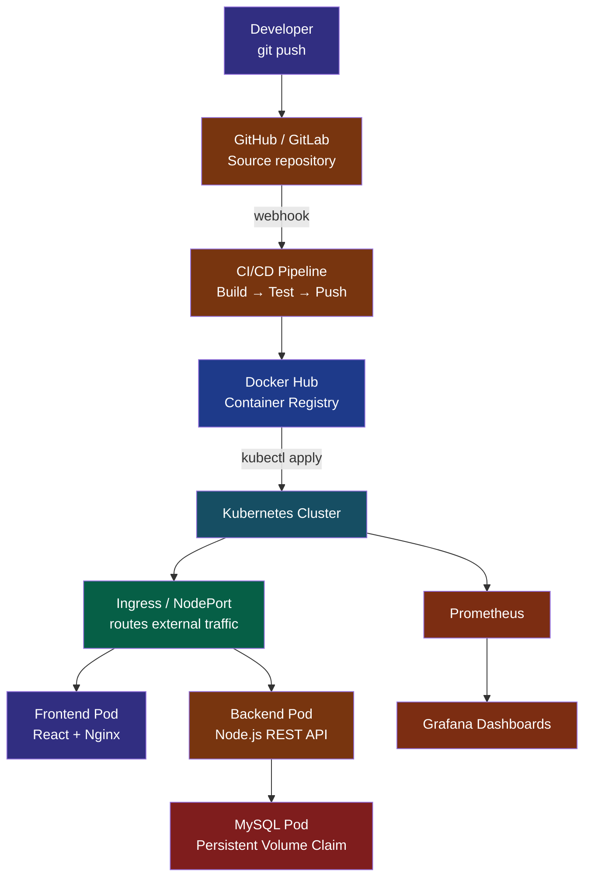

<!-- ===========================
     DEVOPS DEVELOPER DASHBOARD
============================ -->

<div align="center">


[](https://git.io/typing-svg)

**Building scalable cloud infrastructure, automating deployments, and creating production-ready applications.**

</div>

---

# 👋 Hi, I'm Varad

💼 DevOps Engineer & Software Developer
📍 India
🎓 Computer Engineering Graduate
☁️ Passionate about Cloud Computing
🚀 Interested in Platform Engineering
⚙️ Love Linux, Kubernetes & Automation

---

# 🏗 DevOps Architecture Dashboard



This reflects my end-to-end approach: code → build → containerize → deploy → observe. GitHub renders Mermaid diagrams natively, so this stays crisp and interactive on the profile page — no external image dependency.

---

# 📊 Developer Dashboard

<table>
<tr>
<td width="50%">

## 💡 About Me

- 🎓 B.Tech Computer Engineering Graduate
- 💼 DevOps Engineer
- ☁️ Passionate about Cloud & Automation
- 🐳 Building production-ready containerized applications
- ⚙️ Love Linux, Kubernetes & CI/CD
- 🌱 Exploring **AIOps, MLOps & Observability**
- 🎯 Goal: Become a Cloud Native DevOps Engineer

</td>

<td width="50%">

## 🔭 Currently Building

- 🤖 AI-powered DevOps Platform
- ☸️ Kubernetes Production Cluster
- 📈 Prometheus Monitoring Stack

## 📚 Currently Learning

- 🔴 OpenShift
- 🔄 GitOps
- 🚀 Argo CD
- 🧠 MLOps
- 🤖 AIOps

</td>
</tr>
</table>

---

# ⚙️ Tech Stack

## 🚀 Programming

<p align="center">

</p>

## 🌐 Frontend

<p align="center">

</p>

## 🖥 Backend

<p align="center">

</p>

## 💾 Databases

<p align="center">

</p>

## ☁️ DevOps & Cloud

<p align="center">

</p>

## 📈 Monitoring

<p align="center">

</p>

## 🐧 Operating Systems

<p align="center">

</p>

## 🛠 Tools & Version Control

<p align="center">

</p>

---

# 📈 GitHub Analytics

<p align="center">


</p>

<p align="center">

</p>

<p align="center">

</p>

## 📅 Detailed Metrics

<p align="center">

</p>

> This card is generated by the community **Metrics** GitHub Action (`lowlighter/metrics`) and shows commit calendar, PRs, issues, stars, and repo activity in one place. It's produced by the included `.github/workflows/metrics.yml` — once you push this repo and Actions run once, `metrics.svg` appears at the repo root and this image renders automatically.

# 🏆 GitHub Trophies

<p align="center">

</p>

---

# 🚀 Production Projects

### 💰 Finance Tracker Platform

Production-style three-tier finance management application deployed on Kubernetes using GitLab CI/CD.

**Architecture:**
```
React → Node.js → MySQL → Docker → GitLab CI/CD → Kubernetes → NGINX → AWS
```

**Key Highlights:**
- Containerized microservice deployment
- Automated CI/CD pipeline
- Kubernetes deployment with persistent storage
- Ingress controller & monitoring integration

**Tech Stack:** Kubernetes, Docker, GitLab CI/CD, MySQL, NGINX, AWS

---

### 📈 StockSense AI

AI-powered stock analysis platform using historical and live market data with intelligent investment insights.

**Architecture:**
```
FastAPI → ML Model → Historical Stock Data → Prediction Engine → REST API → Frontend
```

**Tech Stack:** Python, FastAPI, Machine Learning, Docker

---

### 📝 Kubernetes Notes App

Containerized Notes App with Kubernetes deployment, persistent storage, services, and ingress.

**Key Highlights:**
- Dockerized backend
- MySQL with Persistent Volumes
- ConfigMaps & Secrets
- Services, Deployments & Ingress

**Tech Stack:** Docker, Kubernetes, Node.js, MySQL

> 🔍 More projects: **Infrastructure Automation** (Terraform, AWS) · **Monitoring Stack** (Prometheus, Grafana) · **Jenkins Shared Library** (Jenkins, Groovy, Docker)

---

# 📌 Pinned Repositories

<p align="center">
<a href="https://github.com/Varad-ctrl/stocksense-ai"></a>
<a href="https://github.com/Varad-ctrl/finance-tracker"></a>
</p>

<p align="center">
<a href="https://github.com/Varad-ctrl/kubernetes-notes-app"></a>
<a href="https://github.com/Varad-ctrl/jenkins-shared-library"></a>
</p>

> ⚠️ Replace the `repo=` values above with your **exact** repository names (case-sensitive), and pin the same repos via *GitHub → Your Profile → Customize your pins* so both stay in sync.

---

# 📊 DevOps Skills Dashboard

```
Linux            ██████████ 100%
Git              ██████████ 100%
Docker           ██████████ 100%
Kubernetes       █████████░ 90%
Terraform        ████████░░ 80%
AWS              ████████░░ 80%
Prometheus       ███████░░░ 70%
Grafana          ███████░░░ 70%
OpenShift        ██████░░░░ 60%
AIOps            █████░░░░░ 50%
```

---

# 🎓 Certifications

<p align="center">


</p>

---

# 🗺 DevOps Roadmap

```
Linux             ✅
Git               ✅
Docker            ✅
Kubernetes        ✅
Terraform         ✅
AWS               ✅
Ansible           ✅
Jenkins           ✅
GitLab            ✅
Monitoring        ✅
GitOps            🔄
OpenShift         🔄
AIOps             🔄
```

---

# 🌍 Open Source

⭐ Contributing to the Kubernetes ecosystem
⭐ Exploring Prometheus exporters
⭐ Learning GitHub Actions
⭐ Building reusable DevOps templates

---

# 💬 DevOps Philosophy

> "Automate repetitive work, monitor everything, and build systems that recover gracefully."

---

# 🌐 Connect With Me

<p align="center">
<a href="https://www.linkedin.com/in/varad-jadhav-devops">

</a>
<a href="mailto:varadjadhav1021@gmail.com">

</a>
<a href="https://github.com/Varad-ctrl">

</a>
<a href="https://varad-ctrl.github.io">

</a>
</p>

---

# 👀 Profile Visitors

<p align="center">

</p>

<p align="center">

</p>

## 🐍 Contribution Snake

<p align="center">

</p>

> Generated automatically on every push by the included `.github/workflows/snake.yml` Action, which commits the SVG to an `output` branch. It needs no setup beyond enabling Actions on this repo.

---

<div align="center">

**Built with ❤️ using Markdown**

Linux • Docker • Kubernetes • Cloud • Automation


</div>
